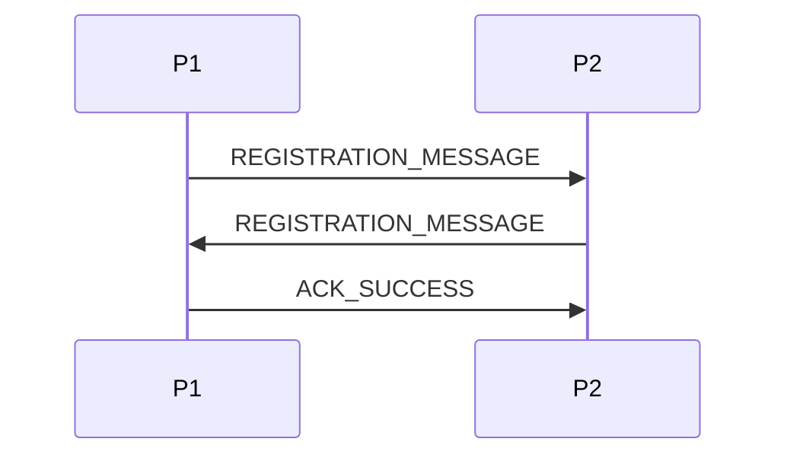
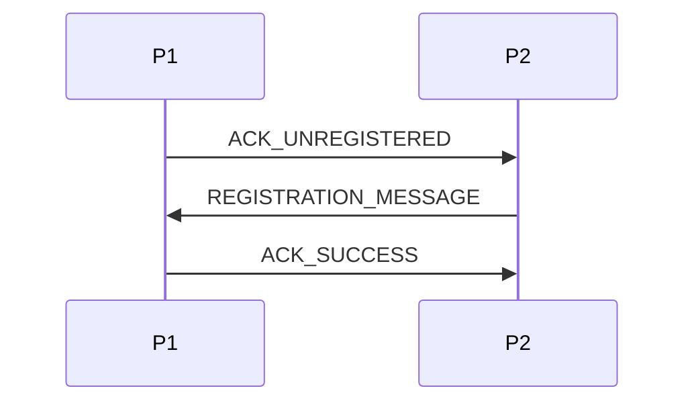
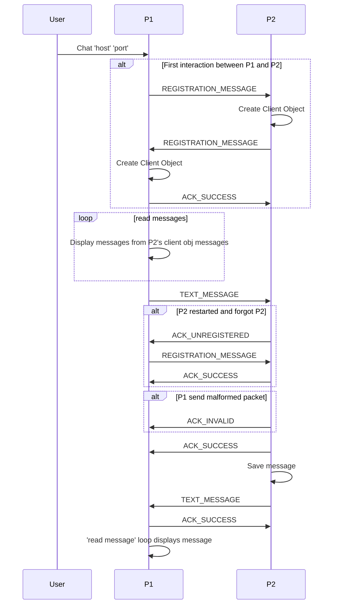
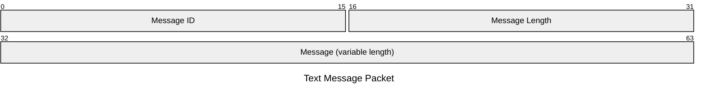
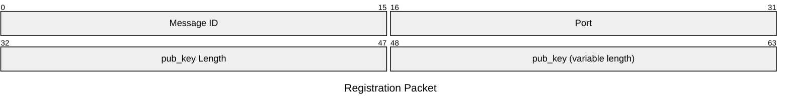
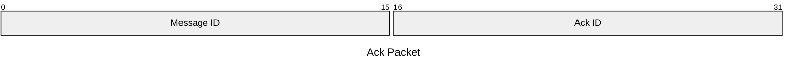

# Gettings started
## Test It Out
find your ip address
```
ip a
```
Create P1
```
python3 main.py
```
Create P2 on a different port
```
PORT=8001 python3 main.py
```
on P1, Connect to P2
```
chat 'ip address from above'
```
you will be prompted from their port. enter 8001.
Then send them a message
```
send 'test message'
```

# Sequence Diagrams:
## Full Registration

## Half Registration

## Example interaction

# Packet Diagrams
## Text Message Packet

## Registration Packet

## Ack Packet



TODO:
- have to change registration to send pubkey and listening port

Known Problems:
- An random empheral port is used to register new peers. This could cause problems on networks with blocked ports.
- does not handle if the host changes their port. Will cause a name conflict with the existing host:port if you try to register a new one.